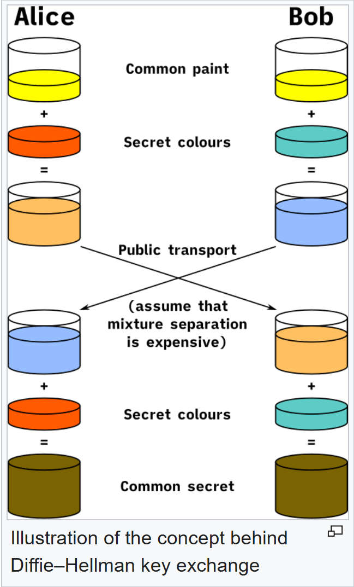

# 7 • Kódování a šifrování

> Kódování dat, šifrování, klasické šifry, symetrické a asymetrické šifrování, Diffie-Hellman, hash
> 

> **Formát:** ~15 minut **čistě ústní** zkoušky, **žádná praktická úloha**. Téma pokrývá rozdíl kódování vs šifrování, historické šifry, moderní kryptografii (symetrickou, asymetrickou, hybridní), hash funkce a okrajově postkvantovou kryptografii.
> 

---

# Část 1: Teorie

### Kódování vs šifrování (kritický rozdíl)

> Tyhle dva pojmy se v běžné řeči pletou. **V IT jde o zásadně různé věci** a tohle bývá první otázka zkoušejícího.
> 

|  | **Kódování** (Encoding) | **Šifrování** (Encryption) |
| --- | --- | --- |
| **Účel** | Přenos, uložení, zobrazení dat | Utajení, bezpečnost |
| **Tajnost** | Veřejně známé, kdokoliv dekóduje | Pouze ten, kdo má klíč |
| **Reverzibilita** | Lze obousměrně bez čehokoliv | Zpět jen s klíčem |
| **Příklad** | ASCII, UTF-8, Base64, Morseovka | AES, RSA, Caesar |

**Vzorová odpověď**: *"Kódování není o tajnosti, je o převodu dat do formátu, který umí přenést nebo zobrazit jiný systém. Base64 zakóduje obrázek do textu pro email, kdokoliv ho zpět dekóduje. Šifrování je naopak o utajení: zpráva se změní tak, aby si ji přečetl jen ten, kdo má správný klíč. Bez klíče to je nesmyslný shluk bajtů."*

---

### Kódování dat

Kódování řeší, jak zapsat lidské znaky tak, aby s nimi dalo technologicky pracovat.

### Morseovka

Kódování písmen do **krátkých a dlouhých signálů** pro přenos po telegrafu.

```
A: .-       B: -...     C: -.-.     SOS: ... --- ...
```

Historicky první masově používané kódování, polovina 19. století.

### ASCII (American Standard Code for Information Interchange)

Základní americká tabulka. Každé písmeno a znak má přiřazené číslo (např. `'A'` = 65, `'a'` = 97, `'0'` = 48).

**Vlastnosti**:

- **7 bitů** (128 znaků)
- Vznikl v USA v 60. letech
- Obsahuje **jen základní anglickou abecedu** + číslice + speciální znaky
- **Neumí**: háčky, čárky, azbuku, čínštinu, emoji

> Důsledek: pro ostatní jazyky bylo třeba něco lepšího.
> 

### Lokální (národní) kódování

S rozšířením počítačů vznikly **8bitové tabulky** pro národní abecedy:

- **Windows-1250** (Microsoft, střední Evropa: čeština, polština, slovenština)
- **ISO-8859-2** (Latin-2, mezinárodní standard pro střední Evropu)
- **Windows-1251** (azbuka)
- **Shift JIS** (japonština)

**Problém**: pokud otevřeš text v jiném kódování, místo "Ř" uvidíš nesmyslné znaky (`Ř` → `Ř` nebo `?`). Klasický nadpis "rozsypaný čaj" (`ÄÚłŽÚÚłŻ`).

### UTF-8 (Unicode)

**Dnešní moderní standard**. Mezinárodní tabulka obsahující znaky všech jazyků světa, emoji, speciální symboly.

**Vlastnosti**:

- **Proměnná délka 1-4 bajty** na znak
- ASCII znaky zůstávají na 1 bajtu (zpětně kompatibilní)
- Češtinu pokryje 2 bajty na znak s háčky
- Emoji typicky 4 bajty
- Pokrývá přes 140 000 znaků (Unicode 15.0)

```
'A' = 0x41 (1 bajt, jako ASCII)
'á' = 0xC3 0xA1 (2 bajty)
'語' = 0xE8 0xAA 0x9E (3 bajty)
'🎓' = 0xF0 0x9F 0x8E 0x93 (4 bajty)
```

> Dnes by **veškerý nový kód měl používat UTF-8**. Žádné nové aplikace s Windows-1250.
> 

### Base64

Kóduje **binární data do textového formátu**, aby šla přenést v médiích, která zvládají jen text (email, JSON, URL).

```
Vstup:  binární data (obrázek, soubor)
Výstup: textový řetězec znaků [A-Z, a-z, 0-9, +, /]
```

**Typické použití**:

- Email přílohy (MIME)
- Data URLs: `data:image/png;base64,iVBORw0KG...`
- API tokeny, JWT
- Embed obrázků v CSS/HTML

> **Není šifrování!** Kdokoliv to triviálně dekóduje. Když uvidíš v emailu Base64, neznamená to bezpečnost.
> 

---

### Klasické (historické) šifry

Dvě základní techniky klasické kryptografie:

### Transpozice vs substituce

| **Transpozice** | **Substituce** |
| --- | --- |
| Písmena zůstávají, **mění se pořadí** | Pořadí zůstává, **mění se písmena** |
| Přesmyčka | Náhrada jinými znaky |
| "AHOJ" → "JOHA" | "AHOJ" → "DKRM" (Caesar +3) |

### Caesarova šifra

Klasická substituce. **Každé písmeno se posune** v abecedě o pevný počet míst.

```
Posun o 3:  A → D,  B → E,  H → K
"AHOJ axo" → "DKRM dyr"
```

**Slabiny**:

- Jen **25 možných klíčů** (posun 0 nemá smysl)
- Útok hrubou silou (brute force) prolomí za sekundy
- Frekvenční analýza: v češtině je nejčastější písmeno `e`, anglicky `e`. Hledej nejčastější písmeno v šifrovém textu a dostaneš klíč.

### Vigenèrova šifra

Složitější substituce, **polyalfabetická**. Místo jednoho čísla se používá **heslo**.

```
Heslo:    AXOAXOAXO
Zpráva:   AHOJSVETE
Posun:    1,24,15,1,24,15,1,24,15  (A=1, X=24, O=15)
Výsledek: BFDKQKFRT
```

Každé písmeno zprávy se posune o jiný počet podle aktuálního písmene hesla. Cyklicky se opakuje.

**Odolnost**: před počítači byla extrémně silná, dnes prolomitelná pomocí Kasiského zkoušky (najde délku hesla podle opakování).

### Enigma

Německý **elektromechanický šifrovací stroj** z 2. světové války. Extrémně složitá substituce, kde se **pravidlo nahrazování měnilo s každým stisknutím klávesy** (přes rotory).

- 3-4 rotorové kotouče + plug board (propojení dvojic)
- 158 962 555 217 826 360 000 možných kombinací (158 kvintilionů)
- Prolomena **Alanem Turingem a týmem ve Bletchley Parku** přes Bombe stroj
- Považuje se za **začátek éry počítačové kryptoanalýzy**

---

### Moderní kryptografie: symetrické šifrování

**Symetrické šifrování** = odesílatel i příjemce mají **jeden stejný tajný klíč**. Tím se zpráva zamkne i odemkne.

```
   Alice                            Bob
   ┌──────┐    [Klíč: S]         ┌──────┐
   │ Text │ ──── šifruj ─────▶  │ ŞĭŦŸ  │ ──── send ─────▶
   └──────┘                      └──────┘
                                                            ┌──────┐
   Klíč: S ──── dešifruj ─────────────────────────────────▶│ Text  │
                                                            └──────┘
```

**Výhody**:

- **Rychlé** (řády rychlejší než asymetrické)
- Nízká výpočetní náročnost (lze šifrovat gigabytes/s)

**Nevýhody**:

- **Problém s předáním klíče** přes nezabezpečený kanál (klasická chicken-and-egg)
- Při N účastnících potřebuješ `N*(N-1)/2` klíčů (pro 100 lidí = 4 950 klíčů!)

**Příklady algoritmů**:

- **AES** (Advanced Encryption Standard) - dnes standard, klíče 128/192/256 bitů
- **DES** - starý, zastaralý (56-bit klíč prolomen)
- **3DES** - DES aplikované 3x, taky zastaralé
- **ChaCha20** - moderní alternativa AES, používá ho TLS

> **AES-256** má 2²⁵⁶ možných klíčů. Prolomit hrubou silou by trvalo déle než **věk vesmíru**, i s každým počítačem na Zemi.
> 

---

### Moderní kryptografie: asymetrické šifrování

**Asymetrické šifrování** = každý má **dva klíče**:

- **Veřejný klíč** (public key): dáš komukoliv, jím se zpráva šifruje
- **Soukromý klíč** (private key): drží jen majitel, jím se zpráva dešifruje

```
   Alice chce poslat Bobovi tajnou zprávu:

   Bob má pár klíčů:           Bob 🔑 (privátní, tajný)
                               Bob 🔓 (veřejný, sdílený)

   Alice:
   ┌──────┐                         ┌──────┐
   │ Text │ ── šifruj Bob 🔓 ────▶ │ ŞĭŦŸ │ ── send ──▶
   └──────┘                         └──────┘

   Bob:
   ┌──────┐                         ┌──────┐
   │ ŞĭŦŸ │ ── dešifruj Bob 🔑 ──▶ │ Text │
   └──────┘                         └──────┘
```

**Výhody**:

- **Řeší problém předávání klíčů**: veřejný klíč můžeš poslat klidně po pohlednici
- Umožňuje **digitální podpisy** (viz dál)
- Pro N účastníků potřebuješ jen N párů klíčů

**Nevýhody**:

- **Pomalejší** (1000x až 10000x než symetrické)
- Vhodné jen pro malá data

**Příklady algoritmů**:

- **RSA** (Rivest-Shamir-Adleman): klasika, založeno na obtížnosti faktorizace
- **ECC** (Elliptic Curve Cryptography): modernější, kratší klíče se stejnou bezpečností
- **DSA**, **EdDSA**: pro digitální podpisy

**Matematický základ**:

- RSA: faktorizace velkého čísla na prvočísla je extrémně pomalá
- ECC: diskrétní logaritmus na eliptické křivce je obtížný

---

### Digitální podpis (obrácený směr asymetrického šifrování)

> Jedna z věcí, kterou symetrické šifrování **neumí**, ale asymetrické ano.
> 

**Cíl**: dokázat, že zprávu poslal opravdu autor (autenticita) a nebyla změněna (integrita).

```
   Podepisování (Alice):

   ┌──────┐    ┌──────┐                      ┌──────┐
   │ Text │ ──▶│ Hash │ ── šifruj Alice 🔑 ▶│Podpis │
   └──────┘    └──────┘    (PRIVÁTNÍ!)        └──────┘
       │                                         │
       └──────── pošli oboje ───────────────────►

   Ověření (Bob):

   ┌──────┐                       ┌────────┐
   │Podpis│ ── dešifruj Alice 🔓▶│Hash A  │
   └──────┘    (VEŘEJNÝ)          └────────┘
                                     │ ?
   ┌──────┐    ┌──────────┐          │ │
   │ Text │ ──▶│ Hash B   │─────────┘ │
   └──────┘    └──────────┘            │
                  Pokud Hash A = Hash B → podpis platí
```

> **Klíčový obrat**: u **šifrování** šifruješ **veřejným**, dešifruješ **privátním**. U **podpisu** šifruješ (podepisuješ) **privátním**, ověřuješ **veřejným**. To je důvod, proč to funguje: jen majitel privátního klíče může vytvořit podpis, ale **kdokoliv** ho ověří.
> 

---

### Diffie-Hellman: výměna klíčů

> **Klasický chyták**: na začátku komunikace nemáme společný klíč, jak ho bezpečně domluvíme přes internet, kde nás hacker odposlouchává?
> 

**Diffie-Hellman protokol** je matematický způsob, jak **bezpečně domluvit sdílený klíč** přes nezabezpečený kanál.

### Analogie s mícháním barev



### Matematicky

Místo barev se používá **modulární umocňování** (`g^a mod p`). Problém: pro hackera je z `g^a mod p` extrémně obtížné získat `a` (diskrétní logaritmus).

```
1. Veřejně se dohodnou na g (generátor) a p (velké prvočíslo)
2. Alice si zvolí tajné a, pošle g^a mod p
3. Bob si zvolí tajné b, pošle g^b mod p
4. Alice spočítá (g^b)^a mod p = g^(ab) mod p
5. Bob spočítá (g^a)^b mod p = g^(ab) mod p
   → Oba mají stejnou hodnotu = sdílený klíč
```

> **Hacker** vidí `g, p, g^a mod p, g^b mod p`, ale spočítat `g^(ab) mod p` znamená vyřešit diskrétní logaritmus, což je výpočetně neproveditelné pro velká p.
> 

---

### Hybridní šifrování

V praxi se **kombinují obě techniky**:

```
1. Asymetricky (RSA nebo DH) si bezpečně domluvíme sdílený klíč
2. Pak rychle šifrujeme symetricky (AES)
```

**Proč to dává smysl**:

- Asymetrické je pomalé, ale řeší výměnu klíče
- Symetrické je rychlé, ale neumí výměnu klíče
- Hybrid: použij asymetrické **jen jednou** pro výměnu, pak rychlé symetrické pro všechny zprávy

### Klasický příklad: HTTPS (TLS handshake)

> Tohle se zkoušejícímu líbí: konkrétní příklad, který každý zná.
> 

```
1. Klient → Server: "Hello, podporuju TLS 1.3, AES-256, RSA"
2. Server → Klient: "OK, taky podporuju" + certifikát s veřejným klíčem
3. Klient ověří certifikát (přes CA: Certificate Authority)
4. Klient → Server: použije DH (nebo ECDHE) pro výměnu klíče
5. Server → Klient: dokončí DH výměnu
   → Oba mají sdílený AES klíč
6. Od teď: HTTP požadavky šifrovány AES-256 sdíleným klíčem
```

Když uvidíš v prohlížeči 🔒, znamená to úspěšně proběhlý TLS handshake s hybridním šifrováním.

---

### Hashovací funkce

**Hashovací funkce** převede libovolně dlouhý vstup na **otisk pevné délky (hash)**.

```
"heslo123"     ──── SHA-256 ────▶ "ef92b778ba..."  (256 bitů)
"heslo124"     ──── SHA-256 ────▶ "5d41402abc..."  (úplně jiný!)
"axo"          ──── SHA-256 ────▶ "8a35eb1a..."
"Lorem ipsum..." ── SHA-256 ────▶ "f7f8e2a3..."  (taky 256 bitů, ať vstup velký jak chce)
```

### Klíčové vlastnosti

1. **Jednosměrnost** (one-way): z hashe **nelze rekonstruovat** původní data
2. **Deterministický**: stejný vstup → vždy stejný hash
3. **Avalanche effect**: drobná změna vstupu → úplně jiný hash
4. **Fixed-length output**: výstup má vždy stejnou velikost (např. SHA-256 = 256 bitů)
5. **Collision resistance**: extrémně těžké najít dva různé vstupy se stejným hashem

### Použití

1. **Ukládání hesel** (nikdy se neukládá heslo, jen jeho hash)
2. **Ověření integrity souboru** (stejný soubor = stejný hash)
3. **Digitální podpisy** (podepisuje se hash, ne celá zpráva)
4. **Blockchain** (každý blok obsahuje hash předchozího)
5. **Deduplikace dat** (stejný hash = duplicitní data)

### Algoritmy

| Algoritmus | Velikost hashe | Status |
| --- | --- | --- |
| **MD5** | 128 bitů | **Prolomený**, nepoužívat pro bezpečnost |
| **SHA-1** | 160 bitů | **Zastaralý**, kolize nalezeny 2017 |
| **SHA-256** | 256 bitů | **Současný standard** |
| **SHA-3** | 256 bitů | Nová generace, jiná konstrukce |
| **BLAKE2/3** | Variabilní | Modernější, rychlejší než SHA-256 |

---

### Hashování hesel: kritické detaily

### Problém: rainbow tables

Útočník si předem spočítá hashe pro miliony běžných hesel a uloží do tabulky (rainbow table). Když získá databázi hashů, prostě vyhledává:

```
Databáze obsahuje: hash("heslo123") = ef92b778...
Rainbow table:    "heslo123" → ef92b778...

Útočník najde heslo za sekundy.
```

### Řešení 1: Salt

**Salt** je náhodný řetězec přidaný k heslu **před** hashováním:

```
heslo: "axo"
salt:  "x7Hc9pL2qR" (uložen v databázi vedle hashe, otevřený!)

Hash = SHA-256("axo" + "x7Hc9pL2qR") = a5e6f1...
```

**Klíčové**:

- Každý uživatel má **jiný salt**
- Salt je v databázi **otevřený** (není tajný), to nevadí
- Rainbow table útočník musí spočítat pro **každý salt zvlášť**, exponenciálně náročné

### Problém 2: SHA-256 je moc rychlé

Moderní GPU počítá miliardy SHA-256 hashů za sekundu. I se saltem může útočník brute force zkusit miliony hesel za vteřinu.

### Řešení 2: Pomalé hash funkce pro hesla

**Speciální hash funkce navržené, aby byly POMALÉ** a paměťově náročné:

- **bcrypt** (Blowfish-based, 1999)
- **scrypt** (memory-hard, 2009)
- **Argon2** (vítěz Password Hashing Competition 2015, **doporučený dnes**)

```
SHA-256("heslo"):       ~10 nanosekund (GPU: miliardy/s)
bcrypt("heslo", cost=12): ~250 milisekund (GPU: ~10 000/s)
Argon2 ("heslo"):       ~100 milisekund + GB paměti
```

> **Pravidlo**: **pro hesla nepoužívej SHA-256 ani MD5 samotné**. Vždy bcrypt, scrypt, nebo Argon2 s saltem (ten se generuje automaticky).
> 

---

### HMAC: Hash s klíčem pro autenticitu

> Drobnost, ale zkoušející ji ocení.
> 

**HMAC** (Hash-based Message Authentication Code) je **hash kombinovaný s tajným klíčem**.

```
HMAC(klíč, zpráva) = otisk_s_klíčem
```

**K čemu**:

- Ověření **autenticity** zprávy: kdo ji poslal? Jen ten, kdo zná klíč.
- Ověření **integrity**: nebyla zpráva změněna v cestě?

**Příklad použití**: JWT tokeny v API (header.payload.signature), kde signature = HMAC(secret, header+payload).

---

### Složitost šifrování

Bezpečnost šifry závisí na tom, jak těžké je ji prolomit:

| Typ složitosti | Popis |
| --- | --- |
| **Výpočetní** | Čas potřebný pro brute-force, roste **exponenciálně s délkou klíče** |
| **Matematická** | Obtížnost problému, na kterém šifra stojí (faktorizace, diskrétní logaritmus) |
| **Kvantová odolnost** | Kvantové počítače mohou prolomit RSA (Shorův algoritmus) |

**AES-256**: 2²⁵⁶ ≈ 10⁷⁷ možných klíčů. **Více než atomů ve viditelném vesmíru** (~10⁸⁰).

**RSA-2048**: závisí na obtížnosti faktorizace 617místných čísel. Klasické počítače to zvládnou až za triliony let.

---

### Postkvantová kryptografie

**Problém**: kvantové počítače budou umět prolomit klasické asymetrické šifry.

**Shorův algoritmus** (1994) na **dostatečně velkém kvantovém počítači** zvládne:

- Faktorizaci velkých čísel → **prolomí RSA**
- Diskrétní logaritmus → **prolomí Diffie-Hellman a ECC**

> **Důsledek**: pokud se postaví dostatečně silný kvantový počítač (zatím nejsou, ale možná za 10-20 let), současné HTTPS, SSH, PGP budou prolomena.
> 

**Postkvantová kryptografie** (PQC) jsou algoritmy **odolné i vůči kvantovým útokům**. Založené na jiných matematických problémech:

- **Lattice-based** (mřížkové): CRYSTALS-Kyber (KEM), CRYSTALS-Dilithium (podpis)
- **Hash-based**: SPHINCS+
- **Code-based**: Classic McEliece

NIST vybral standardy 2022-2024, postupně se nasazují (TLS 1.3 už podporuje hybrid s Kyberem).

> **Symetrické šifry (AES) a hash funkce (SHA-256)** jsou kvantově odolnější. Grovers algoritmus jen půlí efektivní velikost klíče (AES-256 bude v kvantové éře "jen" AES-128, ale to je pořád bezpečné).
> 

---

### Rychlý tahák

| Téma | Klíčová fakta |
| --- | --- |
| **Kódování** | Převod dat pro přenos/zobrazení, **ne tajné** (ASCII, UTF-8, Base64) |
| **Šifrování** | Utajení pomocí klíče |
| **Caesarova šifra** | Substituce, posun písmen o pevný počet míst |
| **Vigenèrova šifra** | Polyalfabetická substituce s heslem |
| **Enigma** | Elektromechanická substituce, WW2, prolomil Turing |
| **Transpozice vs substituce** | Mění pořadí (transpozice) vs mění písmena (substituce) |
| **Symetrické** | Jeden klíč pro obě strany, rychlé (**AES**) |
| **Asymetrické** | Veřejný + soukromý klíč, pomalé (**RSA**, ECC) |
| **Diffie-Hellman** | Výměna klíčů přes nezabezpečený kanál, analogie barev |
| **Hybridní** | DH/RSA pro výměnu klíče → AES pro data (**HTTPS**) |
| **Digitální podpis** | Šifruj hash privátním, ověř veřejným (obrácený směr) |
| **Hash** | Jednosměrný otisk, nelze zpětně rekonstruovat (**SHA-256**) |
| **Salt** | Náhodný řetězec přidaný k heslu před hashováním, brání rainbow tables |
| **bcrypt/Argon2** | Pomalé hash funkce **pro hesla** (ne SHA-256!) |
| **HMAC** | Hash s tajným klíčem, autenticita + integrita |
| **Postkvantová kryptografie** | Odolná vůči kvantovým počítačům (Kyber, Dilithium) |

---

## Část 2: Tipy pro ústní zkoušku

### Optimální struktura odpovědi (15 minut)

Doporučené pořadí, jak procházet téma:

1. **Začni rozdílem kódování vs šifrování** (1-2 min)
2. **Kódování**: ASCII → UTF-8 → Base64 (2 min)
3. **Historické šifry**: transpozice/substituce, Caesar, Vigenère, Enigma (2-3 min)
4. **Symetrické**: AES + problém s předáním klíče (2 min)
5. **Asymetrické**: RSA + řeší předávání klíčů, ale pomalé (2 min)
6. **Diffie-Hellman**: analogie s barvami (2 min)
7. **Hybridní = HTTPS**: spojuje výhody obou (1-2 min)
8. **Hash + salt + bcrypt**: pro ukládání hesel (1-2 min)
9. **(Bonus) Postkvantová kryptografie**: pokud zbude čas (1 min)

### Klíčové vzorové odpovědi

> **Otázka: "Jaký je rozdíl mezi kódováním a šifrováním?"**
> 

> *"Tyhle pojmy se sice často zaměňují, ale jsou zásadně odlišné. Kódování slouží k převodu dat do formátu, který umí přenést nebo zobrazit jiný systém: ASCII převede znaky na čísla, UTF-8 podporuje všechny jazyky světa, Base64 převede binární data na text pro email. Není to o tajnosti, kódování je veřejně známé a kdokoliv ho dekóduje. Šifrování je naopak o utajení a bezpečnosti: zpráva se změní tak, aby ji přečetl jen ten, kdo má správný klíč. Pro ostatní to vypadá jako náhodný shluk znaků. Mezi šifrování patří AES nebo RSA."*
> 

> **Otázka: "Co je Diffie-Hellman a proč se používá?"**
> 

> *"Diffie-Hellman je matematický protokol pro bezpečnou výměnu klíčů přes nezabezpečený kanál, typicky internet. Řeší klasický problém symetrického šifrování: oba mají mít stejný klíč, ale jak ho bezpečně předat přes síť, kde nás hacker odposlouchává? Princip vysvětluju analogií s mícháním barev: Alice a Bob se veřejně dohodnou na společné barvě, žlutá. Pak každý smíchá svou tajnou barvu se žlutou a pošle to druhému. Hacker vidí jen směsi, ze kterých neumí oddělit tajnou barvu zpět. Když pak každý přidá svou tajnou barvu do směsi druhého, oba získají stejnou hnědou. To je sdílený klíč. Matematicky se místo barev používá modulární umocňování a problém diskrétního logaritmu. V praxi se Diffie-Hellman používá v TLS handshake při HTTPS, kde si klient a server domluví AES klíč pro celé spojení."*
> 

> **Otázka: "Jak se správně ukládají hesla v databázi?"**
> 

> *"Hesla se nikdy neukládají v plain textu, ani zašifrovaná, ale jako hash. Hash je jednosměrná funkce: ze hesla spočítám otisk pevné délky, ale z otisku neumím zrekonstruovat původní heslo. Při loginu zahasuju zadané heslo a porovnám s uloženým hashem. Problém s obyčejným SHA-256 je dvojí. Za prvé, útočník si může předem spočítat rainbow table, tabulku hashů pro miliony běžných hesel. Řešení je salt, náhodný řetězec přidaný ke heslu před hashováním, jiný pro každého uživatele. Za druhé, SHA-256 je velmi rychlé, moderní GPU počítá miliardy hashů za sekundu. Pro hesla by se měly používat speciálně pomalé funkce jako bcrypt, scrypt, nebo Argon2, které jsou navržené, aby trvaly stovky milisekund a využívaly hodně paměti. To znemožní masivní brute force."*
> 

> **Otázka: "Co se používá v praxi, symetrické nebo asymetrické šifrování?"**
> 

> *"V praxi se obě kombinují, říká se tomu hybridní šifrování. Asymetrické šifrování jako RSA nebo Diffie-Hellman je řádově pomalejší než symetrické AES, ale řeší problém s předáváním klíčů. Symetrické AES je rychlé, zvládne šifrovat gigabytes za sekundu, ale potřebuje sdílený klíč. Hybridní přístup používá asymetrické šifrování jen na začátku komunikace pro výměnu klíče, a pak rychle pokračuje symetrickým. Přesně tak funguje HTTPS: TLS handshake probíhá asymetricky, klient a server si přes Diffie-Hellman domluví sdílený AES klíč, a od té chvíle už všechny HTTP požadavky jsou šifrované AES. To je důvod, proč vidíš na zámku v prohlížeči."*
> 

### Časté chytáky

| Otázka | Odpověď |
| --- | --- |
| *Rozdíl kódování a šifrování?* | Kódování pro přenos (veřejné), šifrování pro utajení (s klíčem). |
| *Je Base64 šifrování?* | Ne, je to kódování. Kdokoliv ho triviálně dekóduje, žádný klíč. |
| *Proč ASCII nestačí?* | 7 bitů = 128 znaků, jen anglická abeceda. Bez háčků, azbuky, čínštiny. |
| *Co je UTF-8?* | Mezinárodní kódování s proměnnou délkou 1-4 bajty, zpětně kompatibilní s ASCII. |
| *Caesar vs Vigenère?* | Caesar = posun o pevné číslo (25 klíčů). Vigenère = posun podle hesla, polyalfabetické. |
| *Co prolomilo Enigmu?* | Alan Turing a tým ve Bletchley Parku přes stroj Bombe. Začátek éry počítačové kryptoanalýzy. |
| *Symetrické vs asymetrické?* | Symetrické = 1 sdílený klíč (rychlé, problém s předáním). Asymetrické = veřejný + privátní (pomalé, řeší předávání). |
| *Co je problém symetrického?* | Jak bezpečně předat klíč přes nezabezpečený kanál. |
| *Jak funguje DH?* | Matematická "směs", oba účastníci přidají tajnou složku, hacker neumí oddělit. Analogie barev. |
| *Co je hybridní šifrování?* | Asymetrické pro výměnu klíče, pak rychlé symetrické pro data. Příklad: HTTPS. |
| *Jak funguje digitální podpis?* | Šifruj hash zprávy privátním klíčem, ověř veřejným. Obrácený směr asymetrického šifrování. |
| *Co je hash?* | Jednosměrná funkce, vstup → otisk pevné délky. Nelze zpět. |
| *Lze z hashe získat heslo?* | Ne, hash je jednosměrný. Ale brute force s rainbow table jde. |
| *Co je salt a proč?* | Náhodný řetězec ke heslu před hashováním. Brání rainbow table útokům. Každý uživatel má jiný. |
| *Proč ne SHA-256 pro hesla?* | Moc rychlé, GPU počítá miliardy/s. Pro hesla bcrypt/Argon2, navržené pomalé. |
| *Co je AES?* | Současný standard symetrického šifrování. Klíče 128/192/256 bitů. |
| *Co prolomí kvantový počítač?* | Asymetrické šifry (RSA, DH, ECC) přes Shorův algoritmus. Symetrické AES a hash funkce zůstávají bezpečné. |
| *Co je postkvantová kryptografie?* | Algoritmy odolné kvantovým útokům. Lattice-based jako Kyber, Dilithium. NIST je standardizoval. |
| *Proč HTTPS používá certifikáty?* | Aby klient věděl, že komunikuje se správným serverem (autenticita). Certifikát podepisuje CA. |
| *Co je HMAC?* | Hash s tajným klíčem, ověřuje autenticitu i integritu zprávy. Používá ho JWT. |

### Klíčové pojmy

| Pojem | Rychlá odpověď |
| --- | --- |
| **Kódování** | Převod dat pro přenos/zobrazení, veřejné |
| **Šifrování** | Utajení pomocí klíče |
| **ASCII** | 7-bit, jen anglické znaky |
| **UTF-8** | Mezinárodní standard, 1-4 bajty/znak |
| **Base64** | Binární → textové kódování |
| **Transpozice** | Mění pořadí písmen |
| **Substituce** | Nahrazuje písmena jinými |
| **Caesar** | Posun o pevné číslo |
| **Vigenère** | Polyalfabetická substituce s heslem |
| **Enigma** | WW2 stroj, prolomil Turing |
| **Symetrické šifrování** | Jeden klíč, rychlé (AES) |
| **Asymetrické šifrování** | Veřejný + privátní klíč (RSA) |
| **Veřejný klíč** | Sdílíš, kdokoliv šifruje |
| **Privátní klíč** | Tajný, dešifruješ a podepisuješ |
| **Diffie-Hellman** | Výměna klíče přes nezabezpečený kanál |
| **Hybridní šifrování** | DH/RSA + AES kombinace (HTTPS) |
| **Digitální podpis** | Šifruj hash privátním, ověř veřejným |
| **Hash** | Jednosměrný otisk pevné délky |
| **Salt** | Náhodný řetězec k heslu před hashováním |
| **bcrypt, scrypt, Argon2** | Pomalé hash funkce pro hesla |
| **HMAC** | Hash s tajným klíčem (autenticita) |
| **SHA-256** | Současný hash standard |
| **TLS handshake** | HTTPS proces výměny klíčů |
| **CA (Certificate Authority)** | Autorita podepisující certifikáty |
| **Postkvantová kryptografie** | Odolná kvantovým útokům |
| **Shorův algoritmus** | Prolomí RSA na kvantovém počítači |
| **AES** | Standard symetrického šifrování |
| **RSA** | Klasický asymetrický algoritmus |

### Co určitě zmínit pro plný počet bodů

1. **Konkrétní rozdíl** kódování vs šifrování (s příklady)
2. **UTF-8** jako moderní standard, **proč ASCII nestačí**
3. Aspoň jeden **konkrétní historický příklad** (Caesar, Enigma) s mechanismem
4. **Problém s předáváním klíče** u symetrického
5. **Veřejný + privátní klíč** u asymetrického + **digitální podpis**
6. **Diffie-Hellman** s analogií barev
7. **HTTPS jako hybridní šifrování** v praxi
8. **Hash, salt, bcrypt** u ukládání hesel
9. **(Bonus)** Postkvantová kryptografie, kvantové hrozby