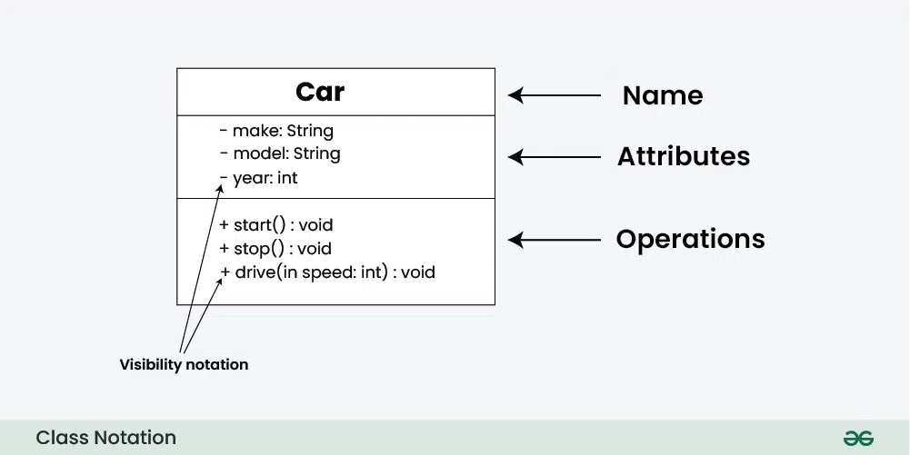

# 1 — Diagramy UML

> **Cíl:** umět o tom mluvit 10-15 min souvisle, k tomu odpovědět na 2-3 follow-up otázky komise.
> **Předmět:** SWI
> **Popis (oficiální):** UML, diagramy tříd, vztahy a kardinalita, diagramy aktivit, sekvenční diagramy, případy užití
> **Souvisí s:** SWI 9 (OOP — třídy, dědičnost), DAT 15 (ER model — vztah s UML), všechny SWI témata používají class diagramy.

---

## Co řeknu jako první (30 s úvod)

**UML** (*Unified Modeling Language*) je **standardizovaný grafický jazyk pro vizualizaci, návrh a dokumentaci** softwarových systémů. Spravuje ho organizace **OMG**. Definuje **14 typů diagramů** ve dvou kategoriích: **strukturální** (z čeho je systém složený) a **behaviorální** (jak funguje). V praxi se nejčastěji potkáme s 5 diagramy: **Class, Use Case, Activity, State Machine, Sequence**.

---

## Klíčové pojmy

- **UML** — Unified Modeling Language, standardizovaný grafický jazyk
- **OMG** — Object Management Group, standardizační organizace UML
- **14 typů diagramů** — 7 strukturálních + 7 behaviorálních
- **Class diagram** — třídy, atributy, metody, vztahy (nejdůležitější)
- **Use Case diagram** — co může uživatel se systémem dělat
- **Activity diagram** — tok aktivit (moderní vývojový diagram)
- **State Machine** — stavy objektu a přechody
- **Sequence diagram** — časová posloupnost zpráv mezi objekty
- **Visibility modifiers** — `+` public, `-` private, `#` protected, `~` package
- **Vztahy** — asociace, agregace, kompozice, generalizace, realizace, závislost
- **Multiplicita** — kardinalita vztahu (1, 0..1, *, 1..*, 2..5)

---

## Hlavní výklad

### 1. K čemu UML slouží

- **Komunikace v týmu** — mezi vývojáři, analytiky, zákazníkem
- **Dokumentace** architektury systému
- **Návrh PŘED kódováním** — analýza, plánování
- **Reverse engineering** — z existujícího kódu vygenerovat diagramy
- **Code generation** — z diagramů vygenerovat kostru kódu (vzácné)

### 2. Rozdělení UML diagramů (14 typů)

**Strukturální** (7) — Z čeho je systém složený?

| Diagram | Co ukazuje |
|---|---|
| **Class diagram** | Třídy, atributy, metody, vztahy |
| **Object diagram** | Konkrétní instance v daný moment |
| **Package diagram** | Logické skupiny tříd (moduly) |
| **Component diagram** | Softwarové komponenty a rozhraní |
| Composite structure | Vnitřní struktura komponenty |
| Deployment | Fyzické nasazení (servery, HW) |
| Profile | Rozšíření UML pro doménu |

**Behaviorální** (7) — Jak systém funguje?

| Diagram | Co ukazuje |
|---|---|
| **Use Case** | Co může uživatel se systémem dělat |
| **Activity** | Tok aktivit (vývojový diagram) |
| **State Machine** | Stavy objektu a přechody |
| **Sequence** | Časová posloupnost zpráv |
| **Communication** | Vztahy mezi objekty (bez časové osy) |
| Timing | Změny stavu v čase |
| Interaction Overview | Kombinace activity a interakce |

V praxi 5 nejčastějších: **Class, Use Case, Activity, State Machine, Sequence**.

---

### 3. Class diagram — nejdůležitější UML

**Anatomie třídy** — obdélník se 3 sekcemi:



```
┌──────────────────┐
│   <<Class>>      │   ← stereotyp (volitelný)
│   ClassName      │   ← název třídy
├──────────────────┤
│ - field: int     │   ← atributy (private)
│ + name: string   │   ← atributy (public)
├──────────────────┤
│ + Method(): void │   ← metody
│ - Helper(): int  │
└──────────────────┘
```

**Visibility modifiers (viditelnost):**

| Symbol | Význam | C# ekvivalent |
|---|---|---|
| `+` | Public | `public` |
| `-` | Private | `private` |
| `#` | Protected | `protected` |
| `~` | Package | `internal` |

**Speciální značení:**

| Co | Jak |
|---|---|
| Abstraktní třída | Název *kurzívou* nebo stereotyp `<<abstract>>` |
| Statický člen | **Podtržené** |
| Rozhraní | Stereotyp `<<interface>>` |
| Enumeration | Stereotyp `<<enumeration>>` |
| Abstraktní metoda | *Kurzívou* |

---

### 4. Vztahy v Class diagramu

| Vztah | Značka | Význam |
|---|---|---|
| **Asociace** | `───────` | Základní vztah, objekty si o sobě "vědí" |
| **Agregace** | `───────◇` | Celek-část, část přežije celek (prázdný kosočtverec) |
| **Kompozice** | `───────◆` | Silná vazba, část bez celku nedává smysl (plný kosočtverec) |
| **Generalizace** | `───────▷` | Dědičnost (`extends`), šipka na rodiče |
| **Realizace** | `- - - -▷` | Implementace rozhraní (`implements`), přerušovaná čára |
| **Závislost** | `- - - -▶` | A používá B, ale neukládá si referenci |

**Klasický chyták — Agregace × Kompozice:**

| | Agregace `◇` | Kompozice `◆` |
|---|---|---|
| Symbol | Prázdný kosočtverec | Plný kosočtverec |
| Životní cyklus | Část **přežije** celek | Část **umírá s celkem** |
| Příklad | **Tým ◇ Hráč** (hráč přežije tým) | **Dům ◆ Pokoj** (pokoj neexistuje bez domu) |
| Jiný příklad | Knihovna ◇ Kniha | Auto ◆ Motor |
| Sdílení | Část může být ve víc celcích | Část v jednom celku |

Mantra: ***"Agregace = volnější (přežije), Kompozice = silnější (zemře)."***

---

### 5. Multiplicita (kardinalita)

Píše se nad/pod konce čar vztahu.

| Zápis | Význam |
|---|---|
| `1` | Právě jeden |
| `0..1` | Žádný nebo jeden (nepovinný) |
| `*` nebo `0..*` | Libovolný počet (i 0) |
| `1..*` | Alespoň jeden |
| `2..5` | Od 2 do 5 |
| `n` | Konkrétní počet (např. `4` rohů auta) |

**Příklady:**

```
[Student] 1 ──── 1..* [Kurz]      // student je v 1+ kurzech, kurz má 1+ studentů
[Auto]    1 ──── 4    [Kolo]      // auto má přesně 4 kola
[Osoba]   0..1 ── 0..* [Telefon]  // telefon má 0-1 majitele, osoba má libovolně telefonů
```

---

### 6. Use Case diagram (případy užití)

Odpovídá na otázku: **"Co může uživatel se systémem dělat?"**


**Klíčové prvky:**

| Prvek | Význam |
|---|---|
| **Actor** (postavička) | Uživatel nebo externí systém |
| **Use case** (elipsa) | Akce, kterou aktér se systémem dělá |
| **System boundary** (obdélník) | Hranice systému |
| **Association** (čára) | Aktér používá use case |
| **`<<include>>`** | Use case A **vždy** zahrnuje B (přihlášení) |
| **`<<extend>>`** | Use case B **volitelně rozšiřuje** A (zapomenuté heslo) |
| **Generalization** | Dědičnost mezi use cases nebo aktéry |

**Pravidla:**
- Aktér je **role**, ne konkrétní osoba
- Use case popisuje **CO**, ne **JAK** (žádné implementační detaily)
- Use case má vždy **konkrétní výsledek** pro aktéra

**Příklad:**
```
        ┌────────────────────────┐
        │   E-shop systém        │
        │                        │
 👤 ───→│  ( Prohlížet produkty )│
Kazek   │  ( Přidat do košíku   )│
        │  ( Objednat           )│ ←──── <<include>> Přihlášení
        │                        │
        │  ( Spravovat objednávky)│ ←──── 👤 Admin
        └────────────────────────┘
```

---

### 7. Activity diagram (diagram aktivit)

**Moderní verze vývojového diagramu.** Popisuje **tok aktivit** — vhodný pro business procesy a algoritmy.


**Klíčové elementy:**

| Tvar | Význam |
|---|---|
| ● (plný kruh) | Začátek |
| ⬤ (kruh v kruhu) | Konec celého toku |
| ⊗ (kruh s X) | Konec jedné větve |
| Zaoblený obdélník | Krok aktivity |
| ◇ (kosočtverec) | **Větvení** (if/switch), s `[guard]` |
| ◇ | Spojení po větvení |
| ▬ (tlustá čára) | **Paralelní rozdělení** (Fork) |
| ▬ | Synchronizace paralelních větví (Join) |
| Sloupec (swimlane) | Kdo akci provádí (oddělení/role) |

**Příklad:**
```
●  → [Zadat objednávku] → ◇ [Cena > 1000?]
                          /              \
                       ano                ne
                        ↓                  ↓
                  [Schválit šéf]      [Auto-OK]
                        \              /
                         → [Odeslat] → ⬤
```

---

### 8. State Machine diagram (stavový diagram)

Popisuje **životní cyklus objektu** — stavy a přechody.


**Elementy:**

| Element | Význam |
|---|---|
| **State** | Stav, ve kterém objekt je |
| **Transition** | Přechod mezi stavy: `událost [guard] / akce` |
| **Initial state** ● | Startovní stav |
| **Final state** ⬤ | Konečný stav |
| **Composite state** | Stav obsahující vnořené substavy |
| **Self-transition** | Přechod do sebe (při události provede akci) |
| **Guard** `[podmínka]` | Přechod proběhne jen pokud podmínka platí |
| **Entry / exit / do** | Akce při vstupu / opuštění / průběhu stavu |

**Příklad — objednávka:**
```
● → [Nová] → [Zaplacená] → [Odeslaná] → [Doručena] → ⬤
        ↘ [Storno]                    ↘ [Vrácena]
```

---

### 9. Sequence diagram (sekvenční diagram)

**Časová posloupnost zpráv** mezi objekty. **Čas plyne shora dolů.**


**Klíčové elementy:**

| Element | Význam |
|---|---|
| **Lifeline** (svislá přerušovaná čára) | Časová osa objektu |
| **Activation bar** (úzký obdélník) | Doba, kdy objekt něco vykonává |
| **Synchronous message** (plná šipka) | Volání, **čeká** na návrat |
| **Asynchronous message** (otevřená šipka) | Volání, **nečeká** |
| **Return message** (přerušovaná šipka) | Návratová hodnota |
| **Self-message** | Volání na sebe |
| **Object creation** | Šipka přímo na objekt |
| **Object destruction** | × na konci lifeline |

**Combined fragments (rámečky):**

| Fragment | Co dělá |
|---|---|
| `alt` | Alternativa (if-else) |
| `opt` | Volitelná akce (if) |
| `loop` | Cyklus |
| `par` | Paralelní vykonání |
| `break` | Předčasné ukončení |

**Příklad:**
```
[Klient]    [Webserver]    [DB]
   │            │            │
   │── login ──▶│            │
   │            │── SELECT ─▶│
   │            │◀── user ───│
   │◀── token ──│            │
```

---

### 10. UML vs ER pro databáze

**ER diagram** (Entity-Relationship) **NENÍ součástí UML** — je to samostatná notace (Chen 1976, dnes nejčastěji **Crow's Foot** notace).


**Kardinalita v ER:**

| Kardinalita | Význam |
|---|---|
| **1:1** | Jeden má jednoho (student má jeden index) |
| **1:N** | Jeden má víc (učitel má víc kurzů) |
| **N:M** | Více má víc (studenti na víc kurzech) |

**Vazební tabulka pro N:M** — v relačních DB se N:M nedá uložit přímo, vždy potřebuje **vazební tabulku**:

```
STUDENT (id PK, jmeno, email)
KURZ (id PK, nazev, kredity)
ZAPIS (student_id FK, kurz_id FK, datum)   ← vazební tabulka
```

---

## Konkrétní příklady


### Class diagram s dědičností a rozhraním

```
┌─────────────────┐         ┌────────────────────┐
│ <<interface>>   │         │   <<abstract>>     │
│   IPlatable     │         │     Zvire          │
├─────────────────┤         ├────────────────────┤
│ + zaplat()      │         │ + name: string     │
└────────────────┘          │ # makeSound(): void│
       △                    └────────────────────┘
       ┊                              △
       ┊ implements                   │ extends
       ┊                              │
┌─────────────────┐         ┌────────────────────┐
│   Pes           │────────▷│ ...                │
├─────────────────┤
│ + jmeno: string │
│ + zaplat(): void│
│ + makeSound()   │
└─────────────────┘
```

### Use Case s include/extend

```
                   <<include>>
[Objednat] ────────────────────▶ [Přihlásit se]
    │
    │ <<extend>>
    ▼
[Aplikovat slevu]
```

---

## Vztahy / kontrasty

- **Class × Object diagram:** Class = šablona (Auto má atribut color). Object = instance s konkrétní hodnotou (auto1: color="červené").
- **Activity × Sequence:** Activity = tok kroků v procesu. Sequence = časová interakce mezi objekty.
- **Use Case × Activity:** Use Case = **CO** uživatel dělá. Activity = **JAK** to probíhá uvnitř (detail use case).
- **UML × ER:** UML pro **OOP design**, ER pro **databáze** (Crow's Foot je dnešní standard).
- **Agregace × Kompozice:** přežije × umírá s celkem.
- **Generalizace × Realizace:** dědičnost třídy × implementace rozhraní.

---

## Nástroje pro tvorbu UML

| Nástroj | Charakter |
|---|---|
| **Draw.io / diagrams.net** | Zdarma, browser, jednoduchý |
| **PlantUML** | Text-to-diagram, git-friendly |
| **Mermaid** | Markdown-friendly (GitHub, Notion) |
| **Modelio** | Open source plnohodnotný UML editor |
| **Lucidchart** | Online, kolaborace v reálném čase |
| **Visual Paradigm** | Profesionální, placené |

---

## Časté otázky komise

**Q:** Co je UML a k čemu slouží?
**A:** UML (Unified Modeling Language) je **standardizovaný grafický jazyk pro vizualizaci, návrh a dokumentaci** softwarových systémů. Spravuje ho **OMG** (Object Management Group). Definuje 14 typů diagramů ve dvou kategoriích: **strukturální** (z čeho je systém složený) a **behaviorální** (jak funguje). Slouží pro **komunikaci v týmu** (vývojáři, analytici, zákazník), **dokumentaci**, **návrh PŘED kódováním**, případně **reverse engineering** z kódu nebo **code generation** z diagramu.

**Q:** Jaké jsou nejdůležitější UML diagramy?
**A:** V praxi 5 nejčastějších: **Class** (třídy + atributy + metody + vztahy), **Use Case** (co může uživatel se systémem dělat), **Activity** (tok aktivit, jako vývojový diagram), **State Machine** (stavy objektu a přechody), **Sequence** (časová posloupnost zpráv mezi objekty). Class diagram je nejdůležitější — slouží jako návod pro programátora.

**Q:** Co je rozdíl mezi agregací a kompozicí?
**A:** Obě jsou vztah celek-část. **Agregace** (prázdný kosočtverec `◇`) — část **přežije** celek (Tým ◇ Hráč: když tým zanikne, hráč existuje dál). **Kompozice** (plný kosočtverec `◆`) — část **umírá s celkem** (Dům ◆ Pokoj: zboření domu zničí i pokoje). Mantra: *"Agregace volnější, kompozice silnější."*

**Q:** Co jsou visibility modifiers v UML class diagramu?
**A:** Symboly před atributem/metodou označující přístupnost: **`+`** public (`public` v C#), **`-`** private (`private`), **`#`** protected (`protected`), **`~`** package (`internal` v C#, package-private v Javě).

**Q:** Co znamenají symboly `<<include>>` a `<<extend>>` v Use Case diagramu?
**A:** **`<<include>>`** — use case A **VŽDY** zahrnuje B. Typický příklad: "Objednat" vždy zahrnuje "Přihlásit se". **`<<extend>>`** — use case B **VOLITELNĚ** rozšiřuje A. Typický příklad: "Přihlásit se" může být rozšířen o "Zapomenuté heslo" (jen někdy).

**Q:** Jak se modeluje multiplicita (kardinalita) v UML?
**A:** Číslem nad/pod koncem čáry vztahu: **`1`** (právě jeden), **`0..1`** (nepovinný), **`*`** nebo **`0..*`** (libovolný počet), **`1..*`** (alespoň jeden), **`2..5`** (rozsah). Příklad: `[Student] 1 ──── 1..* [Kurz]` = student je v 1+ kurzech, kurz má 1+ studentů.

**Q:** Co je Activity diagram a kdy se používá?
**A:** Activity diagram je **moderní verze vývojového diagramu** — popisuje **tok aktivit**. Hodí se pro **business procesy** a **algoritmy**. Klíčové elementy: ● začátek, ⬤ konec, zaoblený obdélník = aktivita, ◇ kosočtverec = větvení (s `[guard]` podmínkou), ▬ tlustá čára = paralelní rozdělení/sloučení (Fork/Join), swimlanes = sloupce kdo akci provádí.

**Q:** Co je Sequence diagram a co ukazuje?
**A:** Sequence diagram zobrazuje **časovou posloupnost zpráv mezi objekty**. Kdo komu volá a v jakém pořadí. **Čas plyne shora dolů.** Klíčové: **lifeline** (svislá přerušovaná čára objektu), **activation bar** (kdy objekt něco vykonává), **synchronní zpráva** (plná šipka, čeká na návrat) × **asynchronní** (otevřená šipka, nečeká), **return** (přerušovaná). Combined fragments pro řízení toku: `alt`, `opt`, `loop`, `par`.

**Q:** Jak souvisí UML a ER diagram?
**A:** **ER diagram NENÍ součástí UML** — je to **samostatná notace** (Chen 1976, dnes Crow's Foot). UML je pro **OOP design** (třídy, objekty, chování), ER pro **databáze** (entity, atributy, relace). Kardinality v ER: **1:1, 1:N, N:M**. **N:M se v relačních DB nedá uložit přímo** — vždy potřebuje **vazební tabulku** s dvojicí cizích klíčů.

---

## Status

- **Sebehodnocení (před):** 4/10
- **Sebehodnocení (po):** _/10
- **Datum poslední revize:** 2026-05-17
