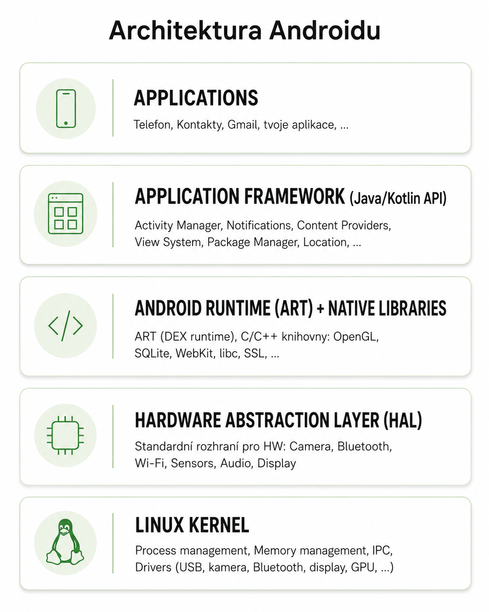

# 25 — Architektura a komponenty Android aplikací

> **Cíl:** umět o tom mluvit 15 min souvisle, k tomu odpovědět na 2–3 follow-up otázky komise.
> **Předmět:** SWI
> **Souvisí s:** [[09-oop]] (lifecycle ≈ ctor/dtor), [[22-aspnet]] (DI + lifecycle paralela), [[18-react]] (Compose = deklarativní jako React)

---

## Co řeknu jako první (30 s úvod)

> *Android je open-source mobilní operační systém spravovaný Googlem, postavený na Linuxovém kernelu. Architektonicky je to **zásobník vrstev** — Linux Kernel, HAL, ART s nativními knihovnami, Application Framework a samotné aplikace. Každá aplikace běží v **sandboxu** pro izolaci a bezpečnost a skládá se ze **čtyř základních komponent: Activity, Service, Broadcast Receiver a Content Provider**, registrovaných v povinném souboru AndroidManifest.xml.*

---

## Klíčové pojmy

- **Android** — Linux-based OS od Googlu, jazyk **Kotlin** (od 2017 preferovaný), IDE Android Studio, build system Gradle
- **ART (Android Runtime)** — VM Androidu, nástupce Dalvik (od Android 5.0, 2014), **hybrid AOT + JIT**
- **DEX** — bytecode formát pro ART (Dalvik Executable, `.dex`)
- **Sandbox** — každá aplikace = vlastní Linux UID + vlastní proces + vlastní filesystem
- **AndroidManifest.xml** — povinný config, registrace komponent + práva + intent filters
- **Intent** — zpráva spouštějící komponentu, **explicitní** (znám cíl) × **implicitní** (systém vybere)
- **Activity Lifecycle** — onCreate → onStart → onResume → onPause → onStop → onDestroy
- **MVVM** — Model-View-ViewModel, doporučená Google architektura; ViewModel **přežije rotaci**
- **Jetpack Compose** — moderní deklarativní UI framework (stable 2021), `@Composable` funkce

---

## Hlavní výklad

### 1. Architektura Android platformy (5 vrstev)



**Zdola nahoru:**

1. **Linux Kernel** — paměť, procesy, drivery, bezpečnost (UID per app). Mírně upravený mainline Linux (Binder IPC, wakelocks).
2. **HAL (Hardware Abstraction Layer)** — standardní rozhraní HW. Aplikace volá "fotit", HAL přeloží na driver kamery.
3. **Android Runtime + Native Libraries** — **ART** + C/C++ knihovny (OpenGL, SQLite, WebKit, libc, SSL).
4. **Application Framework** — Java/Kotlin API pro vývojáře (Activity Manager, Notifications, Location).
5. **Applications** — systémové (Kontakty, Telefon) + third-party.

**Princip:** každá vrstva poskytuje služby vrstvě nad ní a abstrahuje od té pod ní.

### 2. ART (Android Runtime)

ART nahradil **Dalvik VM** v Androidu 5.0 (Lollipop, 2014). Spouští bytekód aplikací ve formátu **DEX**.

**Cesta od kódu k běžící aplikaci:**
```
.kt / .java  →  (kotlinc/javac)  →  .class  →  (D8/R8)  →  .dex
     → balíček .apk → instalace → ART AOT + JIT → strojový kód CPU
```

**ART vs Dalvik:**

| | Dalvik (do 5.0) | ART (od 5.0) |
|---|---|---|
| Kompilace | JIT (za běhu) | **Hybrid AOT + JIT** |
| Instalace | Rychlejší | Pomalejší (AOT kompiluje) |
| Spuštění app | Pomalejší | Rychlejší |
| Paměť | Menší | Větší (uložený AOT kód) |

Od Android 7.0 **profile-guided AOT** — sleduje časté části kódu a v klidu (nabíjení) je překompiluje AOT. Best of both.

### 3. Sandbox

Každá aplikace dostane **vlastní Linux UID** → vlastní proces, vlastní paměť, vlastní filesystem (`/data/data/com.app.x/`).

**Důsledky:**
- **Bezpečnost** — App A nemůže šahat na data App B (Linux ochrana)
- **Crash izolace** — pád jedné nesráží systém
- **Sdílení dat** vyžaduje **explicitní mechanismus** (Content Provider, Intent, IPC)

⚠️ Root přístup obchází sandbox z pozice systému.

### 4. Čtyři základní komponenty

| Komponenta | UI? | Účel | Příklad |
|---|---|---|---|
| **Activity** | Ano | Jedna obrazovka | LoginActivity, DetailActivity |
| **Service** | Ne | Background práce | Přehrávání hudby, navigace |
| **Broadcast Receiver** | Ne | Reakce na události | Wifi changed, baterie nízká |
| **Content Provider** | Ne | Sdílení dat mezi aplikacemi | Kontakty, Media, Kalendář |

**Service typy:**
- **Foreground Service** — povinná notifikace (hudba, navigace)
- **Background Service** — omezené od Android 8+
- **Bound Service** — jiná komponenta se připojí přes IPC

Moderní trend: **Single Activity Architecture** — 1 Activity, navigace přes Compose composables / Fragments.

### 5. AndroidManifest.xml

**Povinný config soubor.** Bez registrace v manifestu komponenta **neexistuje**.

**Definuje:**
- Všechny 4 komponenty (Activity, Service, Receiver, Provider)
- **Permissions** (`uses-permission`)
- **`minSdkVersion`, `targetSdkVersion`** — rozsah verzí
- **Ikona, název, theme**
- **Intent filters** — jaké intenty komponenta umí
- **`exported`** flag — od Android 12 povinné

### 6. Permissions (práva)

| Typ | Schválení | Příklady |
|---|---|---|
| **Normal** | Auto při instalaci | INTERNET, VIBRATE |
| **Dangerous** | Runtime, uživatel za běhu | CAMERA, READ_CONTACTS, LOCATION |
| **Signature** | Stejný podpis | Suite od jednoho výrobce |
| **Special** | Settings | SYSTEM_ALERT_WINDOW |

**Runtime permissions** od Android 6.0 (2015) — dangerous se neudělují při instalaci, ale **v okamžiku potřeby**. Dialog s povolit/odmítnout.

### 7. Intent

**Zpráva**, která spouští komponentu nebo přenáší data. Slovo = "záměr".

**Explicitní:** znám cíl
```kotlin
val intent = Intent(this, DetailActivity::class.java)
intent.putExtra("user_id", 69)
startActivity(intent)
```

**Implicitní:** systém najde vhodnou app + případně **Intent Chooser**
```kotlin
val intent = Intent(Intent.ACTION_VIEW, Uri.parse("https://..."))
startActivity(intent)
```

**Intent Filter** v manifestu deklaruje co umím zpracovat (např. `ACTION_SEND` + `text/plain` = registrace pro "sdílet text").

### 8. Activity Lifecycle

| Callback | Kdy | Co dělat |
|---|---|---|
| `onCreate()` | Vytvoří se | Init UI, ViewModel |
| `onStart()` | Viditelná | Start animací |
| `onResume()` | Interakce | Start kamery, GPS |
| `onPause()` | Jiná Activity přijde | Uložit stav |
| `onStop()` | Zcela skryta | Stop těžké operace |
| `onDestroy()` | Ničí se | Uvolnit zdroje |

**Rotace = úplné zničení + vytvoření:**
```
onPause → onStop → onDestroy → onCreate → onStart → onResume
```

Proto **ViewModel** — přežije konfigurační změny.

### 9. MVVM architektura

```
VIEW (Activity / Compose)      "Co vidí uživatel"
        ↓ observuje state
VIEWMODEL                      "Drží UI state, zpracovává actions"
        ↓ volá
MODEL (Repository)             "Data: API, DB, cache"
```

**Výhody:**
- ViewModel **přežije rotaci**
- Oddělení concerns (UI × business logic)
- **Testovatelnost** (ViewModel + Repository bez Android frameworku)
- **Unidirectional Data Flow** — state dolů, události nahoru

### 10. Jetpack Compose

**Moderní deklarativní UI** (stable 2021). Místo XML píšeš Kotlin funkce s anotací `@Composable`.

| | XML + Views (legacy) | Compose |
|---|---|---|
| Paradigma | Imperativní | **Deklarativní** |
| UI def | XML soubory | Pouze Kotlin |
| State | LiveData, manual | **Recomposition** (reactive) |
| Boilerplate | Hodně (findViewById) | Málo |

**Klíčové koncepty:**
- `@Composable` — funkce vracející UI
- `remember { mutableStateOf(0) }` — reaktivní stav přes recomposition
- **State hoisting** — stav nahoru, callbacky dolů (paralela React lifting state up!)

**Bonus:** Compose je k Androidu to, co je React k webu — deklarativní, recomposition = diff Virtual DOMu, hoisting = lifting state up.

---

## Konkrétní příklady / kód

### Activity s Compose
```kotlin
class MainActivity : AppCompatActivity() {
    override fun onCreate(savedInstanceState: Bundle?) {
        super.onCreate(savedInstanceState)
        setContent {
            MaterialTheme {
                MainScreen()
            }
        }
    }
}
```

### Compose counter (≈ React useState)
```kotlin
@Composable
fun Counter() {
    var count by remember { mutableStateOf(0) }
    Column {
        Text("Kliknuto: $count×")
        Button(onClick = { count++ }) { Text("+1") }
    }
}
```

### ViewModel
```kotlin
class UserViewModel(private val repo: UserRepository) : ViewModel() {
    private val _users = MutableStateFlow<List<User>>(emptyList())
    val users: StateFlow<List<User>> = _users.asStateFlow()

    fun loadUsers() = viewModelScope.launch {
        _users.value = repo.getUsers()
    }
}
```

---

## Vztahy / kontrasty

- **vs iOS** — Android: Linux + Kotlin + Compose; iOS: Darwin + Swift + SwiftUI. Sandbox koncept podobný.
- **vs React (SWI 18)** — Compose je k Androidu to, co React k webu. Deklarativní, hooks-like (`remember`), state hoisting = lifting state up.
- **vs ASP.NET (SWI 22)** — DI pattern, lifecycle, repository pattern, MVVM ≈ MVC s view-modelem navíc.
- **MVVM × MVC** — V MVC je View aktivnější (volá Controller). V MVVM je View pasivní (observuje ViewModel). ViewModel nikdy nezná View.

---

## Časté otázky komise

**Q:** Rozdíl ART vs Dalvik?
**A:** Dalvik byl JIT (kompilace za běhu). ART je hybrid **AOT + JIT** — kompiluje při instalaci, profile-guided při nečinnosti. Od Android 5.0 (2014).

**Q:** Co se stane při rotaci telefonu?
**A:** Activity se **úplně zničí a znovu vytvoří** (`onDestroy → onCreate`). **ViewModel přežije**, proto se používá pro stav.

**Q:** Rozdíl explicitního a implicitního Intentu?
**A:** **Explicitní** zná konkrétní cílovou komponentu (vlastní Activity). **Implicitní** deklaruje záměr (`ACTION_VIEW` + URL), systém vybere vhodnou aplikaci, případně přes Intent Chooser.

**Q:** Co je Sandbox a proč?
**A:** Izolace každé aplikace přes **vlastní Linux UID** → vlastní proces, paměť, filesystem. App A nemůže číst data App B. Bezpečnost + crash izolace + nucené sdílení přes Content Provider/Intent.

**Q:** Proč MVVM a ne MVC v Androidu?
**A:** MVVM odděluje **state (ViewModel)** od View. ViewModel **přežívá konfigurační změny** (rotace), View může být zničeno. V MVC je View aktivnější a stav by se ztrácel.

**Q:** Co je Manifest a proč povinný?
**A:** `AndroidManifest.xml` říká OS strukturu aplikace — komponenty, práva, intent filters, vstupní Activity. Bez registrace v manifestu komponenta **neexistuje** (nelze ji spustit).

**Q:** Jak funguje Compose recomposition?
**A:** Když se mění **State** (`mutableStateOf`), Compose automaticky znovu vyrenderuje **jen komponenty, které ten state čtou**. Princip podobný React diffu Virtual DOMu, ale na úrovni jednotlivých `@Composable` funkcí.

---

## Co bych ještě měl vědět (volně)

- **AOSP** (Android Open Source Project) — custom ROMy LineageOS, GrapheneOS, Evolution X
- **Background restrictions** od Android 8 — Foreground Service místo Background pro dlouhé úlohy
- **Coroutines** — `suspend` funkce, `viewModelScope.launch`, `Dispatchers.IO`/`Main`
- **Flow / StateFlow** — asynchronní stream hodnot, hot vs cold streams
- **Jetpack knihovny:** Room (SQLite ORM), Retrofit (HTTP), WorkManager (deferred work), Hilt (DI), Navigation, DataStore
- **Build:** Gradle, `build.gradle.kts`, plugins, dependencies block
- **Newer Android specifika:** Scoped Storage (10), One-time permissions (11), POST_NOTIFICATIONS dangerous (13), granular gallery (14)

---

## ⚠️ Nejisté / k ověření

- Konkrétní syntax `mutableStateOf` × `mutableStateListOf` — pravděpodobně OK, ale ověřit u Compose docs
- `exported` flag — povinný od **Android 12** ✓
- Verze `compileSdk = 34` vs aktuální 35 (Android 15) — komise nebude testovat verze do detailu

---

## Status

- **Sebehodnocení (před):** 1/10
- **Sebehodnocení (po):** _/10
- **Datum poslední revize:** 2026-05-21
