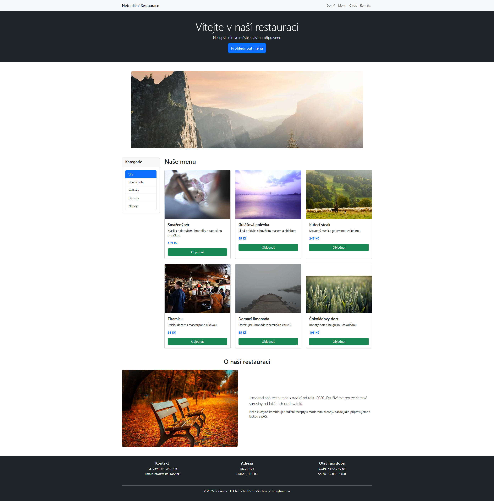
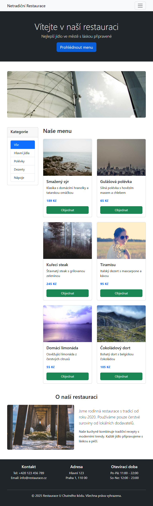
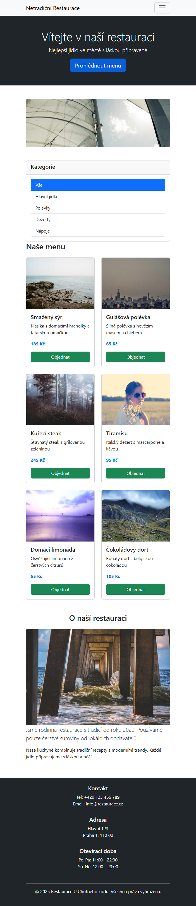
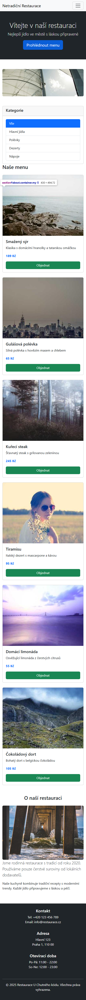

# P4A-Restaurace-Bootstrap-Cviceni
## Zadání úkolu

Vaším úkolem je vytvořit responzivní webovou stránku restaurace pomocí Bootstrap frameworku. Máte k dispozici HTML soubor s kompletní strukturou, ale **bez Bootstrap stylování**. Vaším úkolem je doplnit Bootstrap třídy tak, aby výsledek odpovídal níže uvedenému screenshotu. JavaScript pro filtrování je připravený, ale potřebuje Bootstrap třídy.

### Responzivní breakpointy

| Prefix | Šířka obrazovky | Zařízení |
|--------|----------------|----------|
| (none) | < 576px | Extra small (mobil) |
| `sm` | ≥ 576px | Small (velký mobil) |
| `md` | ≥ 768px | Medium (tablet) |
| `lg` | ≥ 992px | Large (desktop) |
| `xl` | ≥ 1200px | Extra large |

### Desktop

### Tablet 1

### Tablet 2

### Mobile

