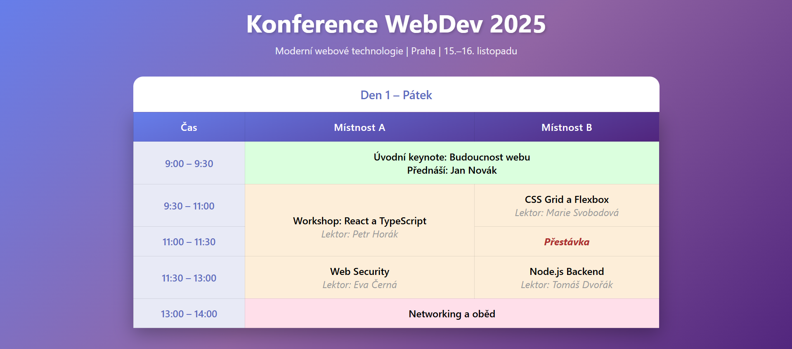

# Konference WebDev 2025 - Zadání

### HTML (`index.html`)
Vytvoř tabulku s:
- Caption, colgroup, thead, tbody
- 3 sloupce: Čas, Místnost A, Místnost B
- 5 řádků programu
- **Jména lektorů dej do `` tagu**

### CSS (`style.css`)
Doplň prázdné selektory. Základní styly (body, nadpisy, gradient) jsou hotové.

**BEM třídy k použití v main.css:**
- `.schedule` - celá tabulka
- `.schedule__caption` - nadpis tabulky
- `.schedule__col--time` - 1. sloupec
- `.schedule__col--room` - 2. a 3. sloupec
- `.schedule__head` - hlavička 
- `.schedule__time` - buňky s časem
- `.schedule__event--keynote` - zelený bg
- `.schedule__event--networking` - růžový bg
- `.schedule__event--break` - červený text
- Lektoři: styluj přes `.schedule td span`

## Důležité detaily (nejsou z obrázku poznat)

**Font-weight:**
- Většina textu: `600`
- **Přestávka: `700`** 
- **span: `400`** 

**Ostatní:**
- Lektoři: `font-size: 0.9rem` (menší než zbytek)

## Ukázka

## Texty ke kopírování

 Den 1 – Pátek
 Čas | Místnost A | Místnost B
 9:00 – 9:30 | 9:30 – 11:00 | 11:00 – 11:30 | 11:30 – 13:00 | 13:00 – 14:00
 Úvodní keynote: Budoucnost webu | Přednáší: Jan Novák | Workshop: React a TypeScript | CSS Grid a Flexbox | Lektor: Marie Svobodová | Lektor: Petr Horák | Přestávka | Web Security | Node.js Backend | Lektor: Eva Černá | Lektor: Tomáš Dvořák | Networking a oběd
